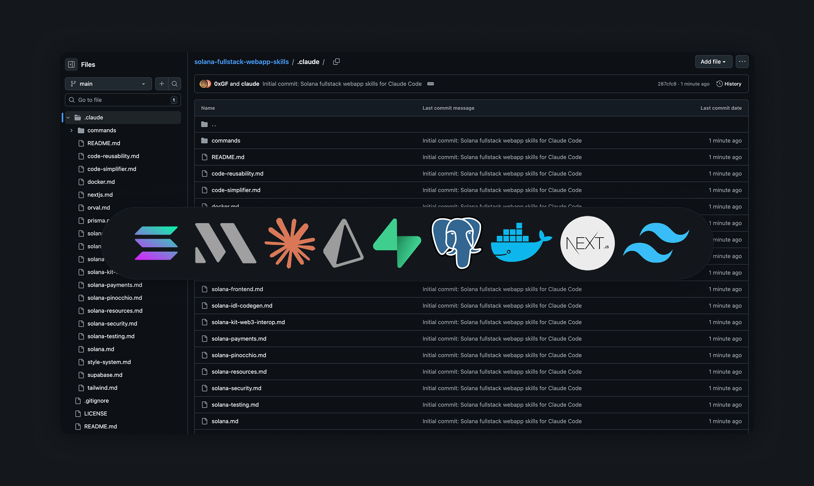

# Solana Fullstack Web App Skills



A comprehensive collection of Claude Code skills for building modern Solana fullstack web applications. These skills provide opinionated guidance, best practices, and reusable patterns for the entire Solana development stack.

## What's Included

### Solana Development Skills

| Skill | Description |
|-------|-------------|
| `solana.md` | Main Solana playbook - framework-kit first approach, modern SDK patterns |
| `solana-anchor.md` | Anchor program development - macros, account types, CPIs, security |
| `solana-pinocchio.md` | Pinocchio for high-performance programs - zero-copy, CU optimization |
| `solana-frontend.md` | Frontend with @solana/client + @solana/react-hooks |
| `solana-kit-web3-interop.md` | Kit ↔ web3.js boundary patterns and migration |
| `solana-testing.md` | Testing with LiteSVM, Mollusk, and Surfpool |
| `solana-idl-codegen.md` | IDL generation and client codegen with Codama |
| `solana-payments.md` | Commerce Kit and payment flows |
| `solana-security.md` | Security checklist for programs and clients |
| `solana-resources.md` | Curated links to docs, tools, and learning resources |

### Web Development Skills

| Skill | Description |
|-------|-------------|
| `nextjs.md` | Next.js 15 with App Router, Server Components, Server Actions |
| `tailwind.md` | Tailwind CSS v4 patterns, responsive design, dark mode |
| `prisma.md` | Prisma ORM - schema design, migrations, type-safe queries |
| `supabase.md` | Supabase - RLS, Auth, Edge Functions, Realtime |
| `docker.md` | Docker and Docker Compose for development and production |
| `orval.md` | API client generation from OpenAPI specs |

### Development Workflow Skills

| Skill | Description |
|-------|-------------|
| `code-reusability.md` | Always check for existing code before writing new |
| `code-simplifier.md` | Clean up complex code at end of sessions |
| `style-system.md` | Design tokens, component patterns, accessibility |

### Commands (Slash Commands)

| Command | Description |
|---------|-------------|
| `/check-existing` | Audit existing components, styles, packages |
| `/commit` | Create well-formatted git commits |
| `/build` | Build all packages |
| `/dev` | Start development servers |
| `/test` | Run tests (Vitest/Jest) |
| `/lint` | Run ESLint |
| `/format` | Format with Prettier |
| `/type-check` | Run TypeScript checks |
| `/db-generate` | Generate Prisma client |
| `/db-push` | Push schema to database |
| `/api-generate` | Generate API client from OpenAPI |
| `/review-pr` | Review a GitHub pull request |
| `/setup` | Set up development environment |
| `/simplify` | Run code simplifier agent |
| `/clean` | Clean build artifacts |

## Getting Started

### Project Kickoff Questionnaire

Starting a new project? Use the **[PROJECT_KICKOFF.md](PROJECT_KICKOFF.md)** questionnaire to help Claude understand what you're building. It covers:

- Project type and target users
- Solana program requirements (Anchor vs Pinocchio)
- Frontend stack (Next.js, Tailwind, UI components)
- Authentication and wallet connection
- Database and API architecture
- Deployment and infrastructure

**Quick start prompt:**
```
I want to build a new Solana web app. Please ask me the project kickoff questions to understand what I'm building, then help me set up the project structure.
```

## Installation

Copy the `.claude` folder to your project root:

```bash
cp -r .claude /path/to/your/project/
```

Or clone this repo and copy what you need:

```bash
git clone https://github.com/0xGF/solana-fullstack-webapp-skills.git
cp -r solana-fullstack-webapp-skills/.claude /path/to/your/project/
```

## Usage

Once the `.claude` folder is in your project, Claude Code will automatically pick up the skills and commands.

### Skills

Skills are automatically loaded based on context. You can also explicitly invoke them:

```
Use the solana-dev skill
Use the nextjs skill
```

### Commands

Commands are invoked with a slash:

```
/commit fix: resolve wallet connection issue
/build
/test frontend
/dev backend
```

## Stack Preferences

These skills are opinionated and prefer:

### Solana
- **Frontend**: `@solana/client` + `@solana/react-hooks` (framework-kit)
- **SDK**: `@solana/kit` for all new code
- **Legacy**: `@solana/web3-compat` at boundaries only
- **Programs**: Anchor (default) or Pinocchio (performance)
- **Testing**: LiteSVM/Mollusk (unit), Surfpool (integration)

### Web
- **Framework**: Next.js 15 with App Router
- **Styling**: Tailwind CSS v4
- **Database**: Prisma with PostgreSQL
- **Backend**: Supabase or custom API

## Customization

Feel free to modify these skills for your specific needs:

1. Edit skill files to match your project patterns
2. Update commands to use your project's script names
3. Add new skills for project-specific guidance
4. Remove skills you don't need

## Contributing

Contributions welcome! Please:

1. Fork the repository
2. Create a feature branch
3. Submit a pull request

## License

MIT License - feel free to use, modify, and distribute.

## Credits

Built with patterns from the Solana ecosystem and modern web development best practices.
